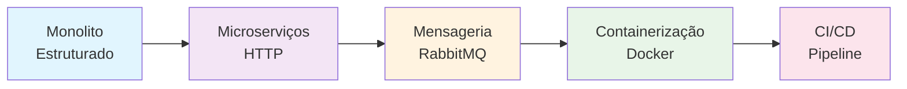
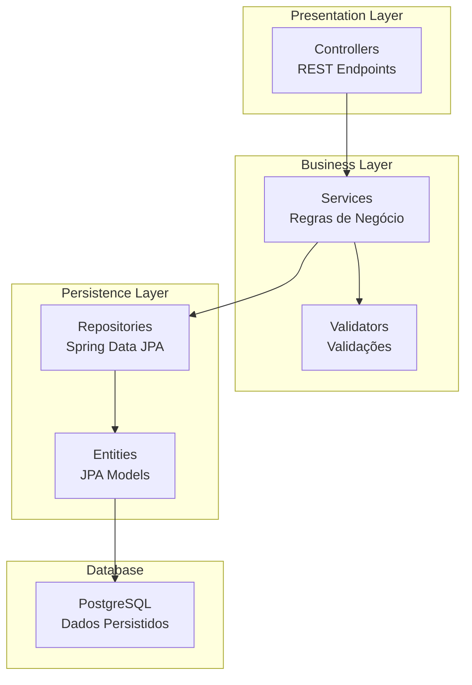
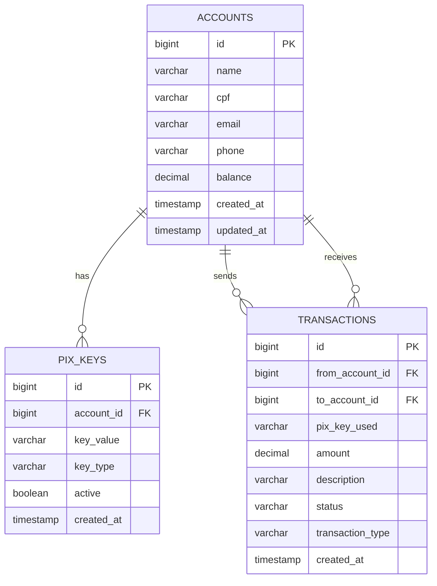

# 💸 PIX System - Sistema de Pagamentos Instantâneos

<div align="center">


**Sistema de pagamentos instantâneos PIX desenvolvido com Spring Boot**
*Demonstração de competências técnicas em desenvolvimento Java backend*

</div>

---

## 📋 Índice

- [Sobre o Projeto](#-sobre-o-projeto)
- [Arquitetura](#-arquitetura)
- [Tecnologias Utilizadas](#-tecnologias-utilizadas)
- [Funcionalidades](#-funcionalidades)
- [Estrutura do Projeto](#-estrutura-do-projeto)
- [Pré-requisitos](#-pré-requisitos)
- [Como Executar](#-como-executar)
- [Documentação da API](#-documentação-da-api)
- [Banco de Dados](#-banco-de-dados)
- [Testes](#-testes)
- [Roadmap](#-roadmap)
- [Contribuição](#-contribuição)
- [Contato](#-contato)

---

## 🎯 Sobre o Projeto

O **PIX System** é um sistema de pagamentos instantâneos que simula as funcionalidades do PIX brasileiro. O projeto demonstra a implementação de um sistema financeiro robusto utilizando **arquitetura em camadas** e **boas práticas** de desenvolvimento Java com Spring Boot.

### 🎨 Contexto de Negócio
- **Gestão de Contas** digitais
- **Chaves PIX** (CPF, email, telefone, aleatória)
- **Transferências PIX** instantâneas
- **Histórico de Transações**
- **Validações de Negócio** rigorosas
- **Auditoria** completa de operações

### 🏗️ Evolução do Projeto



*Atualmente: **Fase 1 - Monolito Estruturado*** ✅

---

## 🏛️ Arquitetura

### 📊 Arquitetura em Camadas (Monolito Atual)



### 🔧 Responsabilidades por Camada

| Camada | Responsabilidade | Tecnologias |
|--------|------------------|-------------|
| **API** | Endpoints REST, DTOs, Exception Handling | Spring Web, Bean Validation |
| **Domain** | Regras de negócio, Services, Models | Spring Core, JPA |
| **Infrastructure** | Persistência, Configurações | Spring Data JPA, PostgreSQL |

---

## 🛠️ Tecnologias Utilizadas

### Core Framework
- **Java 17** - Linguagem principal
- **Spring Boot 3.5.5** - Framework web
- **Maven** - Gerenciamento de dependências

### Persistência & Banco
- **Spring Data JPA** - ORM e repositórios
- **PostgreSQL** - Banco de dados relacional
- **Flyway** - Controle de versão do banco
- **Flyway PostgreSQL** - Driver específico

### Mapeamento & Validação
- **MapStruct 1.6.3** - Mapeamento entre DTOs e Entities
- **Bean Validation** - Validações de entrada
- **Lombok** - Redução de boilerplate

### Documentação & Testes
- **SpringDoc OpenAPI 2.8.9** - Documentação Swagger
- **Spring Boot Test** - Testes integrados

### Utilitários
- **Lombok** - Geração automática de código
- **Maven Compiler Plugin** - Configuração de annotation processors

---

## ⚡ Funcionalidades

### 👥 Gestão de Contas
- ✅ Criar conta digital
- ✅ Consultar dados da conta
- ✅ Atualizar informações pessoais
- ✅ Consultar saldo em tempo real
- ✅ Histórico de movimentações

### 🔑 Chaves PIX
- ✅ Cadastrar chave PIX (CPF, email, telefone, aleatória)
- ✅ Validar formato das chaves
- ✅ Consultar chaves por conta
- ✅ Excluir chave PIX
- ✅ Evitar duplicatas

### 💸 Transferências PIX
- ✅ Transferência entre contas via chave PIX
- ✅ Validação de saldo disponível
- ✅ Confirmação instantânea
- ✅ Geração de comprovante
- ✅ Histórico completo de transações

### 🛡️ Segurança & Validação
- ✅ Validação de CPF
- ✅ Validação de formato de email
- ✅ Validação de telefone
- ✅ Prevenção de operações inválidas
- ✅ Logs de auditoria

---

## 📁 Estrutura do Projeto

### 🗂️ Organização de Pacotes

```
src/main/java/com/misael/pixsystem/
├── api/                           # Camada de Apresentação
│   ├── controller/
│   │   ├── AccountController.java
│   │   ├── PaymentController.java
│   │   └── PixKeyController.java
│   ├── dto/
│   │   ├── request/
│   │   │   ├── CreateAccountRequest.java
│   │   │   ├── PixTransferRequest.java
│   │   │   └── CreatePixKeyRequest.java
│   │   └── response/
│   │       ├── AccountResponse.java
│   │       ├── TransactionResponse.java
│   │       └── PixKeyResponse.java
│   └── exceptionhandler/
│       ├── GlobalExceptionHandler.java
│       └── ApiErrorResponse.java
├── core/                          # Configurações
│   ├── config/
│   │   ├── OpenApiConfig.java
│   │   └── MapStructConfig.java
│   └── mapper/
│       ├── AccountMapper.java
│       ├── TransactionMapper.java
│       └── PixKeyMapper.java
├── domain/                        # Regras de Negócio
│   ├── model/
│   │   ├── Account.java
│   │   ├── Transaction.java
│   │   ├── PixKey.java
│   │   └── enums/
│   │       ├── TransactionStatus.java
│   │       ├── PixKeyType.java
│   │       └── TransactionType.java
│   ├── repository/
│   │   ├── AccountRepository.java
│   │   ├── TransactionRepository.java
│   │   └── PixKeyRepository.java
│   └── service/
│       ├── AccountService.java
│       ├── PaymentService.java
│       ├── PixKeyService.java
│       └── impl/
│           ├── AccountServiceImpl.java
│           ├── PaymentServiceImpl.java
│           └── PixKeyServiceImpl.java
└── PixSystemApplication.java
```

### 📄 Arquivos de Configuração

```
src/main/resources/
├── application.yml                # Configuração principal
├── application-dev.yml           # Ambiente de desenvolvimento
├── application-prod.yml          # Ambiente de produção
└── db/migration/                 # Scripts Flyway
    ├── V1__create_accounts_table.sql
    ├── V2__create_pix_keys_table.sql
    └── V3__create_transactions_table.sql
```

---

## 📋 Pré-requisitos

### 🖥️ Ambiente de Desenvolvimento
- **Java 17+** - [Download OpenJDK](https://openjdk.java.net/projects/jdk/17/)
- **Maven 3.6+** - [Download Maven](https://maven.apache.org/download.cgi)
- **PostgreSQL 12+** - [Download PostgreSQL](https://www.postgresql.org/download/)
- **Git** - [Download Git](https://git-scm.com/downloads)

### 🔍 Ferramentas Recomendadas
- **IntelliJ IDEA** ou **VS Code** - IDE
- **Postman** ou **Insomnia** - Testes de API
- **DBeaver** ou **pgAdmin** - Cliente PostgreSQL

---

## 🚀 Como Executar

### 📦 1. Clone o Repositório
```bash
git clone https://github.com/seu-usuario/pix-system.git
cd pix-system
```

### 🗄️ 2. Configure o Banco de Dados
```sql
-- Conecte no PostgreSQL e execute:
CREATE DATABASE pixsystem;
CREATE USER pixuser WITH PASSWORD 'pixpass123';
GRANT ALL PRIVILEGES ON DATABASE pixsystem TO pixuser;
```

### ⚙️ 3. Configure o application.yml
```yaml
# src/main/resources/application.yml
spring:
  application:
    name: pix-system
  
  datasource:
    url: jdbc:postgresql://localhost:5432/pixsystem
    username: pixuser
    password: pixpass123
    driver-class-name: org.postgresql.Driver
  
  jpa:
    hibernate:
      ddl-auto: validate
    show-sql: true
    properties:
      hibernate:
        format_sql: true
        dialect: org.hibernate.dialect.PostgreSQLDialect
  
  flyway:
    enabled: true
    locations: classpath:db/migration
    baseline-on-migrate: true

server:
  port: 8080

springdoc:
  api-docs:
    path: /api-docs
  swagger-ui:
    path: /swagger-ui.html
```

### ▶️ 4. Execute a Aplicação
```bash
# Instale as dependências e execute
mvn clean install
mvn spring-boot:run

# Ou usando o wrapper (se disponível)
./mvnw spring-boot:run
```

### ✅ 5. Verifique se está funcionando
```bash
# Health check
curl http://localhost:8080/actuator/health

# Swagger UI
# Abra: http://localhost:8080/swagger-ui.html
```

---

## 📚 Documentação da API

### 🌐 Swagger UI
Após executar a aplicação, acesse:
- **Swagger UI**: [http://localhost:8080/swagger-ui.html](http://localhost:8080/swagger-ui.html)
- **API Docs JSON**: [http://localhost:8080/api-docs](http://localhost:8080/api-docs)

### 🔗 Endpoints Principais

#### Gestão de Contas
```http
POST   /api/accounts                    # Criar conta
GET    /api/accounts/{id}               # Consultar conta
GET    /api/accounts/{id}/balance       # Consultar saldo
PUT    /api/accounts/{id}               # Atualizar conta
```

#### Chaves PIX
```http
POST   /api/accounts/{accountId}/pix-keys  # Cadastrar chave PIX
GET    /api/accounts/{accountId}/pix-keys  # Listar chaves da conta
DELETE /api/pix-keys/{keyId}              # Excluir chave PIX
GET    /api/pix-keys/validate/{key}       # Validar chave PIX
```

#### Transferências PIX
```http
POST   /api/transfers/pix               # Realizar transferência PIX
GET    /api/transfers/{id}              # Consultar transferência
GET    /api/transfers/account/{accountId} # Histórico da conta
```

### 📝 Exemplos de Uso

#### Criar Nova Conta
```bash
curl -X POST http://localhost:8080/api/accounts \
  -H "Content-Type: application/json" \
  -d '{
    "name": "João Silva",
    "cpf": "12345678901",
    "email": "joao@email.com",
    "phone": "+5511999999999"
  }'
```

#### Cadastrar Chave PIX
```bash
curl -X POST http://localhost:8080/api/accounts/1/pix-keys \
  -H "Content-Type: application/json" \
  -d '{
    "key": "joao@email.com",
    "type": "EMAIL"
  }'
```

#### Realizar Transferência PIX
```bash
curl -X POST http://localhost:8080/api/transfers/pix \
  -H "Content-Type: application/json" \
  -d '{
    "fromAccountId": 1,
    "pixKey": "maria@email.com",
    "amount": 100.00,
    "description": "Pagamento de teste"
  }'
```

---

## 🗄️ Banco de Dados

### 📊 Modelo de Dados



### 🔄 Migrations Flyway

#### V1 - Criar Tabela de Contas
```sql
-- V1__create_accounts_table.sql
CREATE TABLE accounts (
    id BIGSERIAL PRIMARY KEY,
    name VARCHAR(255) NOT NULL,
    cpf VARCHAR(11) UNIQUE NOT NULL,
    email VARCHAR(255) UNIQUE NOT NULL,
    phone VARCHAR(20),
    balance DECIMAL(15,2) DEFAULT 0.00,
    created_at TIMESTAMP DEFAULT CURRENT_TIMESTAMP,
    updated_at TIMESTAMP DEFAULT CURRENT_TIMESTAMP
);
```

#### V2 - Criar Tabela de Chaves PIX
```sql
-- V2__create_pix_keys_table.sql
CREATE TABLE pix_keys (
    id BIGSERIAL PRIMARY KEY,
    account_id BIGINT NOT NULL,
    key_value VARCHAR(255) UNIQUE NOT NULL,
    key_type VARCHAR(20) NOT NULL,
    active BOOLEAN DEFAULT TRUE,
    created_at TIMESTAMP DEFAULT CURRENT_TIMESTAMP,
    FOREIGN KEY (account_id) REFERENCES accounts(id)
);
```

#### V3 - Criar Tabela de Transações
```sql
-- V3__create_transactions_table.sql
CREATE TABLE transactions (
    id BIGSERIAL PRIMARY KEY,
    from_account_id BIGINT NOT NULL,
    to_account_id BIGINT NOT NULL,
    pix_key_used VARCHAR(255),
    amount DECIMAL(15,2) NOT NULL,
    description TEXT,
    status VARCHAR(20) DEFAULT 'COMPLETED',
    transaction_type VARCHAR(20) DEFAULT 'PIX_TRANSFER',
    created_at TIMESTAMP DEFAULT CURRENT_TIMESTAMP,
    FOREIGN KEY (from_account_id) REFERENCES accounts(id),
    FOREIGN KEY (to_account_id) REFERENCES accounts(id)
);
```

---

## 🧪 Testes

### 🔬 Estrutura de Testes
```
src/test/java/com/misael/pixsystem/
├── api/
│   └── controller/
│       ├── AccountControllerTest.java
│       ├── PaymentControllerTest.java
│       └── PixKeyControllerTest.java
├── domain/
│   ├── service/
│   │   ├── AccountServiceTest.java
│   │   ├── PaymentServiceTest.java
│   │   └── PixKeyServiceTest.java
│   └── repository/
│       ├── AccountRepositoryTest.java
│       ├── TransactionRepositoryTest.java
│       └── PixKeyRepositoryTest.java
└── integration/
    └── PixSystemIntegrationTest.java
```

### 🏃 Executar Testes

```bash
# Todos os testes
mvn test

# Testes específicos
mvn test -Dtest=AccountServiceTest

# Testes com cobertura
mvn clean test jacoco:report

# Testes de integração
mvn test -Dtest="*Integration*"
```

### 📊 Cobertura de Código
- **Meta**: 80%+ de cobertura
- **Relatório**: `target/site/jacoco/index.html`

---

## 🗺️ Roadmap

### ✅ Fase 1 - Monolito (Atual)
- [x] Estrutura de projeto
- [x] Configuração Spring Boot
- [x] Modelos de dados (JPA)
- [x] Repositories e Services
- [x] Controllers REST
- [x] Validações de negócio
- [x] Documentação Swagger
- [ ] Testes unitários completos
- [ ] Testes de integração

### 🔄 Fase 2 - Melhorias (Próxima)
- [ ] Cache com Redis
- [ ] Auditoria avançada
- [ ] Logs estruturados
- [ ] Health checks customizados
- [ ] Profiles de ambiente
- [ ] Docker containerization

### 🚀 Fase 3 - Microserviços (Futura)
- [ ] Separação em microserviços
- [ ] Service Discovery
- [ ] API Gateway
- [ ] Comunicação entre serviços

### 📨 Fase 4 - Mensageria (Futura)
- [ ] RabbitMQ integration
- [ ] Eventos assíncronos
- [ ] Notification service
- [ ] Event sourcing

### 🔧 Fase 5 - DevOps (Futura)
- [ ] CI/CD pipeline
- [ ] Kubernetes deployment
- [ ] Monitoramento (Prometheus)
- [ ] Centralized logging

---

## 🤝 Contribuição

### 📋 Como Contribuir

1. **Fork** o repositório
2. **Crie** uma branch: `git checkout -b feature/nova-funcionalidade`
3. **Commit** suas mudanças: `git commit -m 'Adiciona nova funcionalidade'`
4. **Push** para a branch: `git push origin feature/nova-funcionalidade`
5. **Abra** um Pull Request

### 📝 Padrões de Desenvolvimento
- **Java Code Conventions**
- **Spring Boot Best Practices**
- **Clean Code principles**
- **SOLID principles**
- **Testes unitários obrigatórios**

---

## 📞 Contato

### 👨‍💻 Desenvolvedor
**Misael**

- 📧 **Email**: [seu-email@exemplo.com]
- 💼 **LinkedIn**: [seu-linkedin]
- 🐱 **GitHub**: [seu-github]

### 🎯 Sobre este Projeto
Projeto desenvolvido para demonstrar competências em:
- ☕ **Java 17** com **Spring Boot**
- 🏗️ **Arquitetura em camadas**
- 🗄️ **Persistência** com **JPA/PostgreSQL**
- 📚 **Documentação** com **Swagger**
- 🧪 **Testes** automatizados
- 💳 **Sistemas financeiros**

---

<div align="center">

**💸 Desenvolvido com dedicação e paixão por tecnologia 💸**

*Sistema PIX - Pagamentos Instantâneos do Futuro* 🚀

</div>

---

## 📄 Licença

Este projeto está sob a licença MIT. Veja o arquivo [LICENSE](LICENSE) para mais detalhes.
